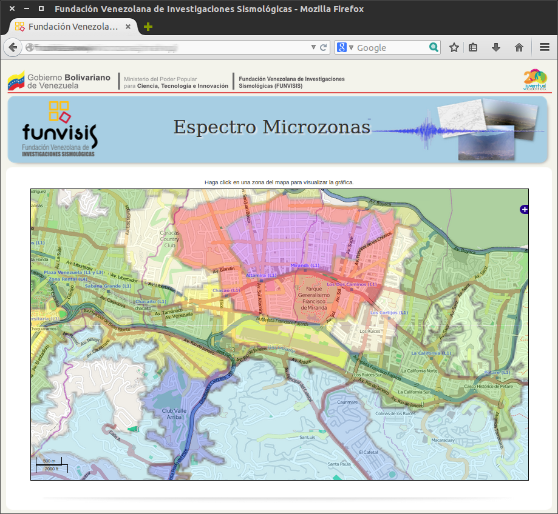
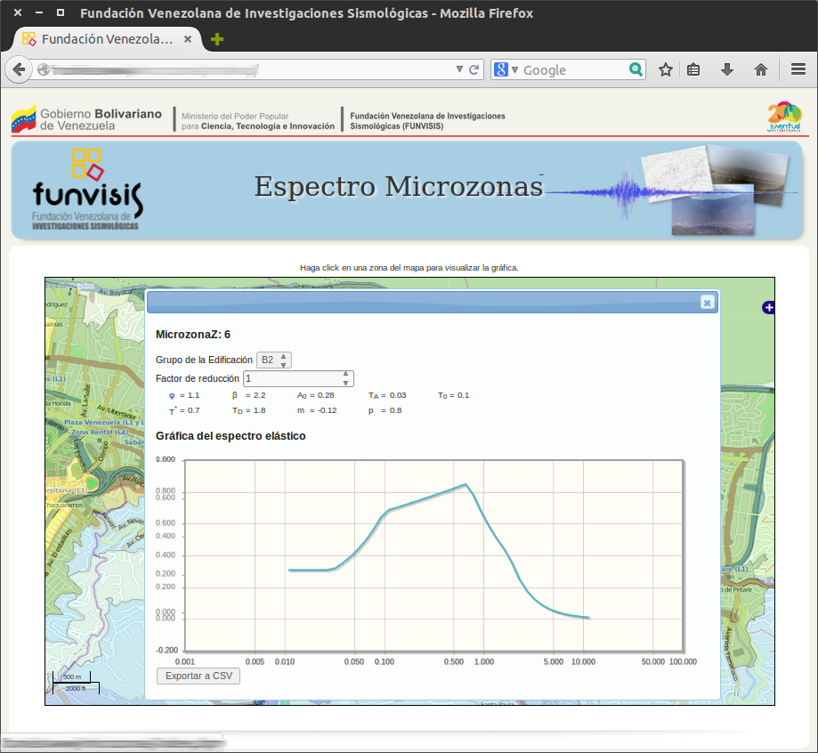

=========
 microzn
=========

Es un *widget* o *aplicacion* web que muestra un mapa representando las
microzonas_ y permite al usuario que consulte los espectros elásticos e
inelásticos de los mismos.

La idea principal de esta aplicación es que el dueño del *site*
reservaría un espacio en alguna página *html* simplemente definiendo
una etiqueta *div* vacía e identificada::

    

En  ese  lugar  se  mostraría entonces  la  aplicación  *microzn*.  La
siguiente imagen  muestra cómo  se vería la  aplicación dentro  de una
página que decidió  incrustarla justo después del  párrafo `Haga click
en una zona del mapa para visualizar la gráfica`, con el siguiente código::

    <!-- contenido de la página -->
    
Haga click en una zona del mapa para visualizar la gráfica

    

    <!--
        En este caso, el dueño de la página decidió darle el nombre de
	"mapa" al espacio reservado para la aplicación.
    -->
    <!-- resto de la página -->

Y la siguiente imágen muestra qué información de espectros se
obtendría al hacer click sobre algún lugar del mapa (noten la opción
de descargar los datos en formato *csv*).

Para utilizar esta *aplicación* es necesario lo siguiente:

1. Un servidor *WMS* compatible que provea las microzonas [#]_.
2. Las bibliotecas *javascript* que requiere esta aplicación (y sus recursos
   respectivos, como imágenes, CSS, etc.).
3. Una página *HTML* o *aplicación WEB* (llamado *aplicación cliente*) que
   utilice este proyecto. Para ello, reservaría un *div*.

La *aplicación o página cliente* debe configurar a la aplicación *microzn*.

Este proyecto sigue el `patrón extendido de Módulo definido por
Requirejs`__. Así que cualquier *aplicación WEB* que utilice este proyecto debe
declarar que *lo require*.

`Lectura recomendada acerca de declarar this en RequireJS`__.

.. [#] Yo estoy utilizando Geoserver_
__ eMPdbr_
__ sradtir_

Cómo utilizar esta aplicación en un página web
==============================================

Primero, debe garantizarse el acceso a todas las dependencias_
declaradas por la aplicación. Aunque esten documentadas en este texto,
es preferible fiarse del contenido del archivo `bower.json`. Este
archivo tiene una sección llamada *dependencies*, que tiene la lista
completa de los componentes que necesita esta aplicación.

Gracias a esto, pudiera ejecutarse el comando `bower install
https://github.com/funvisis/microzn.git`, que se encargaría descargar
*microzn* y todas sus dependencias, guardando todo en una carpeta,
típicamente llamada `bower_components`.

Supongamos que en una carpeta vacía invocamos::

    $ bower install https://github.com/funvisis/microzn.git

Entonces, en una página web sencilla definimos una etiqueta `div`
vacía para la aplicación::

    

Debido a que *microzn* está definida como un módulo según las reglas
de *RequireJS*, esta página debe definir un script que sirva de punto
de entrada a la ejecución de *javascript*. Típicamente, este script se
llama *main.js* y es responsabilidad del dueño de la página. El punto
de entrada se define en la página web::

    

Noten que aunque el `require.js` está en `bower_components` en este
caso, debe ajustarse la ruta a la ubicación real del archivo
`require.js`.

La página web sencilla completa tendría esta forma::

    <html>
      <head>
        
      </head>
      <body>
        

      </body>
    </html>

Este archivo *main.js* (o como lo hayan llamado) que sirve de punto de
entrada, iniciará la ejecución de los módulos que se desee. Entre
ellos, iniciará la ejecución del módulo `microzn`. Sin embargo, hay
que tomar en consideración un par de pasos previos de configuración:

1. La configuración de *RequireJS*
2. La configuración de *microzn*

Configuración de RequireJS
--------------------------

...

Configuración de Microzn
------------------------

La descripción detallada de las opciones de configuración de *microzn*
están en el mismo códifo fuente de la aplicación, en el archivo
`scripts/microzonelib.js`.

Sin embargo, explicaremos aquí la configuración mínima necesaria para
correr la aplicación.

El módulo `microzonelib` define un constructor llamado
`microzonespectrum` que recibe una configuración en forma de un objeto
con atributos y representa la aplicación incrustada en el espacio
reservado por la etiqueta `
`.

Es necesario definir como mínimo tres cosas en la configuración para
que la aplicación funcione:

1. La etiqueta `
` dónde se incrustará la aplicación.
2. El  servidor  *WMS*.
3. Cuáles capas ofrecidas por el servidor son las que representan las
   microzonas y cual campo de cada una tiene la identificación de las
   mismas.

Para definir el elemento *div*, se define el atributo `_div` en la
configuración. Se le asignaría el `id` del elemento. En el caso del
este ejemplo, su valor sería: `microzonas`.

Para definir el servidor *WMS* que tiene las capas de las microzonas,
se define el atributo `geoserver` en la configuració. Se le asignaría
la *URL* del servicio *WMS*: toda la *URL* necesaria para hacer
peticiones *WMS*. Por ejemplo, supongamos que hay una instancia de
*Geoserver* corriendo en el servidor *gis.example.com*funvisis/. La
petición *WMS* más importante es la petición *GetCapabilities*, la
cual genera un reporte de las capacidades del servidor. Si la petición
debe hacerse con la siguiente URL:
`http://gis.example.com/workspace1/wms?request=GetCapabilities`;
entonces el valor del atributo `geoserver` sería:
`http://gis.example.com/workspace1/wms`.

Todas las capas con información de microzonas que quieran incluirse en
la aplicación, deben registrarse en el atributo de la configuración
llamado `microzone_layers`. Este atributo es una lista de
3-tuplas. Cada una de esas 3-tuplas represeta una capa. El primer
componente de la 3-tupla es el texto que queremos que salga en la
aplicación cuando se refiera a la capa. El segundo componente es el
identificador que tiene la capa en el servidor *WMS*. Y el tercer
componente es el nombre del campo de la capa que tiene la
identificación de la microzona.

Por ejemplo. Si en el servidor hay una capa llamada 'general', esta
capa tiene un campo llamado 'microzona' donde está almacenada la
identificación de la microzona, y además queremos que en la aplicación
se muestre el texto *"Amenaza General"* cuando se refiera a esta capa,
entonces la 3-tupla que determinaría esta capa sería::

    ['Amenaza General', 'general', 'microzonas']

La configuración mínima ideal en este ejemplo sería::

    {
        _div : "microzonas",
        geoserver_url : "http://gis.example.com/workspace1/wms",
        microzone_layers : [
    	['Amenaza General', 'general', 'microzonas']
        ]
    }

Pero por los momentos (hasta la próxima versión de la aplicación) hay
que definir explícitamente los siguientes atributos::

    parameter_source : "javascript",
    map_div : "map",
    dialog_div : "dialog",
    chartdiv : "chartdiv"

En definitiva, el archivo `main.js` que sólo desea colocar la
aplicación *microzn* en su lugar sería algo así::

    require.config({
        // Toda la configuració necesaria para RequireJS
    });
    
    require(['microzonelib'], function(microzonelib) {
        var config = {
    	    _div : "microzonas",
    	    geoserver_url : "http://gis.example.com/workspace1/wms",
    	    microzone_layers : [
    	        ['Amenaza General', 'general', 'microzonas']
    	    ],
    	    
    	    parameter_source : "javascript",
    	    map_div : "map",
    	    dialog_div : "dialog",
    	    chartdiv : "chartdiv"
        };
        var Microzonespectrum = new microzonelib.microzonespectrum(config);
        Microzonespectrum.init(config);
    }

Dependencias
============

1. Openlayers_
2. Requirejs_
3. Jquery_
4. Jqplot_
5. Jquery-ui_

.. _eMPdbr: http://requirejs.org/docs/api.html#define
.. _sradtir: http://requirejs.org/docs/api.html#jsfiles
.. _requirejs: http://requirejs.org/
.. _openlayers: http://www.openlayers.org/
.. _jquery: http://jquery.com/
.. _jquery-ui: http://jqueryui.com/
.. _jqplot: http://www.jqplot.com/
.. _microzonas: http://www.funvisis.gob.ve/proy_mic_sismicaccsbqto.php
.. _Geoserver: http://geoserver.org/
